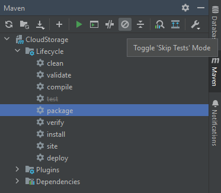
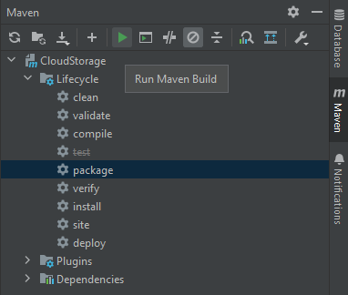
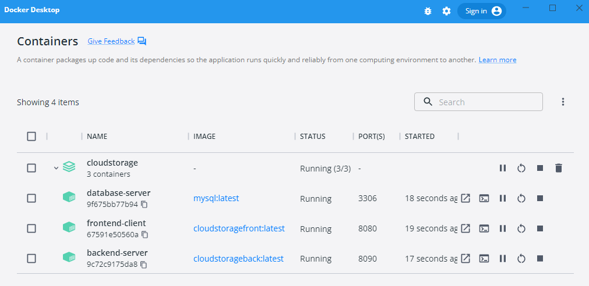
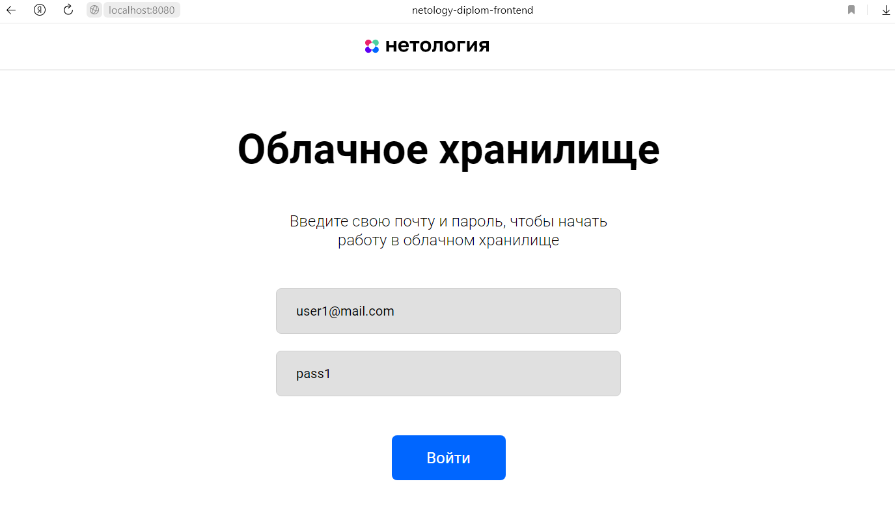
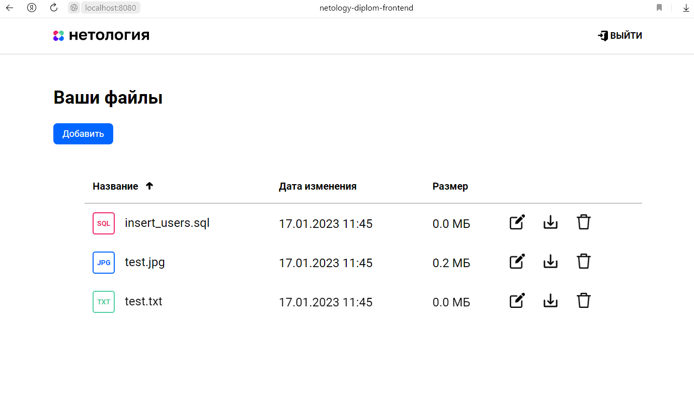

# “Облачное хранилище”

## Описание проекта
Приложение представляет собой REST-сервис, разработанный в соответствии с [техническим заданием](./TechnicalTask.md).
Сервис предоставляет REST интерфейс для загрузки файлов и вывода списка уже загруженных файлов пользователя.
Все запросы к сервису авторизованы. Заранее подготовленное веб-приложение (FRONT) подключается к разработанному сервису
без доработок, а также использует функционал FRONT для авторизации, загрузки и вывода списка файлов пользователя.

## Реализация проекта:
- приложение разработано с использованием Spring Boot;
- использован сборщик пакетов Maven;
- в качестве системы хранения данных используется база данных MySql;
- для управления миграциями используется система Liquibase;
- для запуска используется Docker, Docker-compose;
- код размещен на GitHub;
- код покрыт unit тестами с использованием Mockito;
- добавлены интеграционные тесты с использованием Testcontainers;
- данные о пользователях хранятся в базе данных;
- первичная авторизация проходит по логину и паролю, последущие запросы при работе с файлами авторизуются на основе 
  полученного при первичной авторизации jwt-токена;
- файлы пользователей сохраняются в базе данных.

## Запуск приложения
Для сборки и запуска приложения необходимо наличие установленных на ПК [Maven](https://maven.apache.org/download.cgi) 
и [Docker](https://www.docker.com/products/docker-desktop/). (Если на ПК установлена IntelliJ IDEA, то собрать проект
можно в ней, и отдельно устанавливать Maven не нужно.)

- Скопировать проект на свой ПК (https://github.com/pmart5/CloudStorage.git).

- Перейти в папку проекта `CloudStorage` и запустить терминал.
- Для сборки jar-архива с приложением в терминале выполнить команду `mvn clean package -Dskiptests`.
- Для сборки jar-архива с приложением в IntelliJ IDEA:
  1. открыть проект в IDE;
  2. в правой боковой панели выбрать вкладку Maven и в Lifecycle выбрать package. Отключить этап тестирования, выбрав в
     панели Maven `Toggle 'Skip Tests' Mode`;

  

  3. запустить сборку проекта, выбрав в панели Maven `Run Maven build`.

  

- Сформированный файл `CloudStorage-0.0.1-SNAPSHOT.jar` будет находиться в папке проекта `/target`.
- Запустить Docker, если этого не сделали раньше. Для сборки образов и поднятия контейнеров выполнить в терминале
  команду `docker-compose up`.  
  В результате будут подняты и запущены три контейнера:

  

- Приложение доступно по адресу `http://localhost:8080`.
- При старте приложения в базу данных добавляются два тестовых пользователя с реквизитами доступа:
  1. login: `user1@mail.com`, password: `pass1`;
  2. login: `user2@mail.com`, password: `pass2`.

  

  

- Для выхода из приложения, находясь в терминале нажать комбинацию клавиш "Ctrl+C" или "Ctrl+Break".
- Для удаления Docker-контейнеров в терминале выполнить команду: `docker-compose down`.